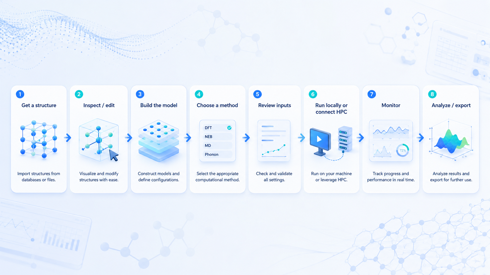

<p align="center">
  
</p>

# CatGo: an AI workbench for computational materials science

<p align="center">
  <a href="readme_new.zh.md">简体中文</a>
  ·
  <a href="https://app.catgo-ucsd.org">Try Online</a>
  ·
  <a href="https://github.com/Hello-QM/catgo-LRG/releases">Download Desktop</a>
  ·
  <a href="https://docs.catgo-ucsd.org">Docs & Tutorials</a>
</p>

<p align="center">

[](https://github.com/Hello-QM/catgo-LRG/actions/workflows/test.yml)
[](license)

</p>

CatGo brings the everyday tools of computational materials science into one workspace: an interactive 3D structure editor, **CatBot** for natural-language operations, a visual DAG workflow engine, remote-cluster access, job monitoring, and analysis of structures, trajectories, electronic properties, and catalysis results.

It is designed for researchers who currently move between a structure builder, terminal, SSH/SFTP client, scheduler commands, log files, and plotting scripts. CatGo does not replace scientific judgment or provide licensed simulation codes and compute resources; it helps you prepare, inspect, run, and organize work in the environments you already use.

> CatGo draws on **[MatterViz](https://github.com/janosh/matterviz)** by [Janosh Riebesell](https://github.com/janosh): the 3D structure viewer, periodic table, and several core UI components originate from MatterViz, though they have been substantially modified in CatGo. On top of that foundation, CatGo adds the catalysis pipeline, workflow engine, HPC integration, CatBot, and plugin system. We are deeply grateful for the original work.

## What CatGo brings together

| Research task                       | What you can do                                                                                                                                                                                     |
| ----------------------------------- | --------------------------------------------------------------------------------------------------------------------------------------------------------------------------------------------------- |
| **View and edit structures**        | Open crystals, molecules, surfaces, volumetric data, and trajectories; rotate, select, measure, add, move, replace, or remove atoms; edit cells and bonds; undo and redo changes                    |
| **Build simulation models**         | Create supercells and Miller-index slabs, add vacuum and frozen layers, place adsorbates, and prepare defects, dopants, heterostructures, nanotubes, MOFs, passivated surfaces, and solvated models |
| **Prepare calculations**            | Generate and review input files, use Quick Build recipes, or connect geometry optimization, single-point, frequency, DOS, NEB, MD, and analysis steps in a visual workflow                          |
| **Work with CatBot**                | Ask for structure retrieval, model construction, workflow editing, file inspection, or analysis in natural language; tool calls remain visible for review                                           |
| **Use your own HPC environment**    | Connect by SSH, browse and edit remote files, open remote structures, submit scheduler jobs, follow logs and convergence, and recover results                                                       |
| **Analyze and communicate results** | Inspect optimization/MD/NEB/IRC trajectories, DOS/PDOS, bands, COHP/ICOHP, charge-density isosurfaces, XRD/RDF, phase diagrams, free-energy diagrams, and volcano plots                             |

---

## CatGo in one minute: From opening a structure to generating ORCA input

This short demo shows the simplest CatGo workflow—no HPC setup or visual workflow required:

1. **Open a structure:** search for a Cu structure and confirm the import.
2. **Inspect it in 3D:** rotate and zoom the structure directly in the viewer.
3. **Open Import / Export:** switch to the **ORCA** export panel.
4. **Prepare the calculation:** choose the run type and electronic-structure settings.
5. **Generate and copy:** create the ORCA input file and copy the ready-to-edit script.

<p align="center">
  
</p>

The same interaction pattern also applies to other supported exporters: load or build a structure, inspect it, choose a target code, review the generated input, then copy or download it.

This clip demonstrates the interface rather than a recommended production calculation. Before running an ORCA job, verify that the molecular model, total charge, spin multiplicity, method, basis set, dispersion treatment, and resource settings are appropriate for your system.

### Prompts you can try

```text
Fetch Cu from Materials Project, cut a four-layer (111) slab,
add 15 Å of vacuum, and place O at a hollow site.
```

```text
Create a VASP relaxation → static → DOS workflow for the current structure.
Let me review the inputs first; do not submit it yet.
```

```text
Read this OUTCAR, tell me whether it converged by maximum force,
and open the final structure.
```

The demo below shows CatBot acting as an agent: it interprets a slab-and-adsorbate request, calls the required CatGo tools, and updates the structure in the viewer. The recording has been condensed for GIF length; the real run includes additional intermediate tool calls and status updates.

<p align="center">
  
</p>

---

## Choose the right way to use CatGo

CatGo has three established day-to-day entry points—desktop, Web, and VS Code—plus an iOS build that has been verified on physical iPhone/iPad hardware and is being distributed as a test or self-built app. Android and CLI/MCP integrations are available for experimental or advanced workflows.

| Entry point                   | Best for                                                                   | Install?                 | Main capabilities                                                                           |
| ----------------------------- | -------------------------------------------------------------------------- | ------------------------ | ------------------------------------------------------------------------------------------- |
| **Desktop app (recommended)** | Researchers who want the complete workflow                                 | Yes                      | Multi-pane workbench, CatBot, workflows, terminal, HPC, and analysis                        |
| **Web app**                   | Instant viewing/editing and first-time evaluation                          | No                       | Browser viewing, editing, building, and export in the hosted static app                     |
| **VS Code extension**         | Users already working in VS Code/Cursor and on remote servers              | Yes                      | View, edit, animate, and export structures/trajectories in the editor                       |
| **iOS app**                   | Researchers testing cluster access, structures, and jobs on an iPhone/iPad | Test build or self-build | Mobile workspace, SSH/SFTP, terminal, structure/trajectory viewing, CatBot, and voice input |
| **Android**                   | Users testing mobile workflows on Android                                  | Experimental             | Mobile workspace, SSH/SFTP, terminal, structure viewer, and mobile AI                       |
| **CLI + MCP/Skills**          | Automation, scripting, and external AI agents                              | Yes                      | Drive CatGo with `catgo`, Claude Code, Codex, or Gemini                                     |

<p align="center">
  
</p>

---

## How to use each platform

### A. Desktop app: the full workbench

1. Download the Windows, macOS, or Linux installer from [GitHub Releases](https://github.com/Hello-QM/catgo-LRG/releases).
2. Launch CatGo and drop in a structure/output file, or fetch a structure from a database.
3. Use the structure toolbar, Quick Build, or CatBot to prepare the model and workflow.
4. For remote calculations, connect your lab's cluster from the HPC panel.
5. Review generated inputs and scheduler settings before approving submission.
6. Monitor the workflow, open resulting structures, and continue to analysis.

### B. Web app: open and start

**Open:** <https://app.catgo-ucsd.org>

1. Drop a structure file into the browser viewer.
2. Rotate, select, edit, build, and export without installing CatGo.

The public site is built in static-only mode, so backend workflows, terminals, and HPC are not available there. Developers may build a backend-enabled static frontend and connect it to a user-owned CatGo backend as described in [`deploy/web/README.md`](deploy/web/README.md). Such a backend has no built-in authentication layer: keep it on loopback or a controlled private network, and never expose it directly to the public internet.

### C. VS Code extension: view beside your code and data

1. Search for **CatGo** in the VS Code Extensions marketplace and install it.
2. Right-click a structure or trajectory and choose **Open with CatGo / Render**.
3. Or press <kbd>Ctrl</kbd>/<kbd>Cmd</kbd> + <kbd>Shift</kbd> + <kbd>V</kbd>.
4. With VS Code Remote SSH, inspect files directly on a remote server.

The extension includes the full single-window viewer and editing tools. It does not include the desktop shell's multi-pane workspace, standalone workflow editor, or complete HPC job manager.

### D. iOS app: your cluster and structures in your pocket

**Best for:** checking jobs away from your workstation, browsing remote files, opening structures/trajectories, and handling cluster tasks from a phone.

1. Open CatGo on an iPhone or iPad.
2. Add your lab's SSH connection using a password, private key, or interactive authentication.
3. Enter a calculation directory through the mobile terminal or SFTP file browser.
4. Tap a structure, trajectory, or output file to open it in the mobile viewer.
5. Inspect and manage SLURM jobs, or use CatBot and voice input for lightweight operations.

The iOS app uses a purpose-built mobile interface rather than a compressed desktop layout. SSH/SFTP runs through an on-device native Rust transport and does not require the desktop Python sidecar. Complex workflow editing and full post-processing are still best handled on desktop.

The iOS build has been verified on a physical device. You can join the public **TestFlight beta** at [testflight.apple.com/join/FdHup5Hz](https://testflight.apple.com/join/FdHup5Hz). Other installation channels and public-release availability should follow the project's latest release notes; developers can also build and sign it with Xcode using the [iOS build guide](deploy/ios/README.md).

### E. Android: experimental mobile app

Android shares the mobile workspace, native SSH/SFTP, terminal access, structure viewing, and mobile AI. It currently suits development testing and specialized mobile use.

- Android: [`deploy/android/README.md`](deploy/android/README.md)
- Android Termux: [`deploy/termux/README.md`](deploy/termux/README.md)

### F. CLI, MCP, and Skills: automation and external agents

The command line, HTTP/stdio MCP tools, and research skills are interfaces for driving CatGo's backend, workflows, and files—not separate graphical platforms.

```bash
catgo setup
catgo serve
catgo status
catgo --help
```

`catgo setup` currently registers the CatGo MCP server and campaign skills for Claude Code. Codex, Gemini, and other agents can use the same MCP endpoints and skills after manual configuration.

These agents can manipulate structures, create file-first campaigns, generate inputs, submit jobs, and analyze results. Desktop CatBot can work with supported SDK agents as well as API-compatible or local model providers. Mobile builds use API-compatible providers rather than the desktop SDK sidecars.

## The common research workflow

```text
Acquire structure → inspect/edit → build model → choose a method
→ review inputs → run locally or connect to HPC → monitor → analyze/export
```

- **Review before submission:** confirm generated structures, input files, pseudopotential/basis paths, and scheduler scripts.
- **Local and HPC capabilities differ:** structure operations and many analyses can run locally or in the browser. Execution location depends on the workflow node and your configuration; licensed or cluster-oriented codes such as VASP and CP2K require an installation and compute environment supplied by you or your institution.
- **CatBot is an interface, not a replacement for scientific judgment:** it calls tools and assembles workflows, while researchers remain responsible for settings and conclusions.
- **Cluster configuration is never safely guessable:** confirm the cluster identity, scheduler, executable or module commands, Python environment, and POTCAR/pseudopotential locations before the first submission.

<p align="center">
  
</p>

The desktop app and file-first campaign tools can cover this complete path. Web, VS Code, and mobile builds focus on the portions appropriate to their platform, such as viewing, editing, file access, monitoring, or lightweight agent operations.

---

## Typical research use cases

### Structure building

Fetch structures from Materials Project or other databases through their APIs; cut slabs, add vacuum, and build supercells; place adsorbates and generate defects, dopants, heterostructures, and MOFs.

<p align="center">
  
</p>

### Computational workflows

Use Quick Build or a visual DAG to connect optimization, single-point, frequency, DOS, NEB, and MD; pre-screen with fast potentials before DFT.

<p align="center">
  
</p>

### Catalysis and free energy

Build and compare OER, HER, ORR, CO₂RR, and NRR pathways; organize adsorption energies, zero-point-energy and thermal corrections, Gibbs free energies, overpotentials, free-energy diagrams, and descriptor-based volcano plots. Free-energy studies require thermochemical data: for each relevant species, use an appropriate geometry optimization and frequency/thermodynamics calculation rather than treating raw electronic energies as Gibbs free energies.

### Trajectories, electronic structure, and publication output

Replay geometry-optimization, MD, NEB, and IRC trajectories; analyze DOS/PDOS, bands, COHP/ICOHP, d-band centers, XRD, RDF, and volumetric charge-density data; export figures, videos, CSV tables, structures, and 3D models. Bader charges produced by an external Bader calculation can be displayed as site properties, but CatGo does not perform the Bader partitioning itself.

<p align="center">
  
</p>

<p align="center">
  
</p>
<p align="center">
  
</p>

---

## Supported software and files

“Supported” can mean several different things. In the tables below, **Read** means that CatGo can import the file into its viewer or data model; **Write** means that it can export a structure or input deck. Neither automatically means that the corresponding simulation program is bundled or licensed.

| Software                     | Read                                                                                       | Write                                               |
| ---------------------------- | ------------------------------------------------------------------------------------------ | --------------------------------------------------- |
| **VASP**                     | POSCAR, CONTCAR, `.vasp`, vasprun.xml, OUTCAR, XDATCAR, CHGCAR/AECCAR/LOCPOT/ELFCAR/PARCHG | POSCAR, INCAR, KPOINTS                              |
| **Quantum ESPRESSO**         | pw.x input (`.in`; scf/relax/…)                                                            | pw.x input                                          |
| **CP2K**                     | `.inp`, `.restart`                                                                         | CP2K input with cell, coordinates, and k-points     |
| **ABACUS**                   | STRU                                                                                       | INPUT, STRU, KPT                                    |
| **ORCA**                     | `.inp`, `.out` with Cartesian/internal/`%coords` geometries                                | ORCA input                                          |
| **Gaussian**                 | `.gjf`, `.com`, Z-matrix, `.log`, `.out`, cube                                             | `.gjf`                                              |
| **CASTEP / SIESTA / OpenMX** | `.cell` / `.fdf` / `.dat`                                                                  | Import only                                         |
| **LAMMPS**                   | `.data`, `.lmp`, dump, `.lammpstrj`                                                        | Data file and run script                            |
| **GROMACS / AMBER / SPARK**  | —                                                                                          | GROMACS input set / AMBER mdin / SPARK kMC-MKM deck |
| **ASE / phonopy / phono3py** | ASE `.traj`, extXYZ / phonopy-family YAML                                                  | extXYZ / import only                                |

| Data type                 | Read                                                                                          | Write                                            |
| ------------------------- | --------------------------------------------------------------------------------------------- | ------------------------------------------------ |
| **Crystallographic**      | CIF, mCIF, pymatgen JSON, OPTIMADE JSON                                                       | CIF, pymatgen JSON                               |
| **Molecular**             | XYZ, extXYZ, mol2, PDB, PubChem JSON                                                          | XYZ, extXYZ, mol2, PDB                           |
| **Trajectory / MD**       | XDATCAR, OUTCAR, multi-frame extXYZ, ASE `.traj`, LAMMPS dump, HDF5, vasprun.xml, JSON frames | Multi-frame extXYZ, WebM/MP4 video, PNG sequence |
| **Volumetric**            | Gaussian cube and the VASP CHGCAR family                                                      | —                                                |
| **Figures and 3D models** | —                                                                                             | PNG, JPG, TIFF, SVG, PDF, GLB, OBJ               |
| **Documents for preview** | PDF, DOCX, XLSX/XLS/ODS, CSV/TSV, Markdown/RST, images                                        | —                                                |

### Calculation and workflow support

- **Production local paths:** structure-building and analysis nodes, ORCA calculations, local LAMMPS modes, and local MLP modes.
- **Functional transitional HPC paths:** VASP, CP2K, xTB, LAMMPS, and MLP workflows through the Python HPC adapter. These paths require SSH plus a configured scheduler and currently have simpler retry/resume behavior than the local DAG engine.
- **Input export without an executable workflow engine:** Quantum ESPRESSO, ABACUS, Gaussian, GROMACS, AMBER, SPARK, and other exporters listed above. Gaussian and GROMACS workflow nodes are not yet executable; the Quantum ESPRESSO workflow engine definition is also not implemented.
- **Skill-assisted guidance:** GPAW, ABINIT, SIESTA, DFTB+, Gaussian, and additional task-specific skills can provide agent-readable procedures or draft inputs. A skill is guidance, not proof that CatGo can execute the code end to end.
- **Fast screening:** MACE, CHGNet, M3GNet, EMT, and xTB/GFN-xTB when their optional packages or executables are installed.
- **Post-processing:** DOS/PDOS, bands, COHP/ICOHP, d-band center, Brillouin-zone tools, XRD, RDF and MD statistics, charge-density visualization, thermochemistry, free-energy diagrams, volcano plots, and phase diagrams.

Feature availability depends on the CatGo edition, installed optional dependencies, and the programs available on your workstation or cluster. CatGo does not redistribute commercial simulation packages, proprietary potentials, pseudopotentials, or cluster allocations.

---

## Install and start

- **Fastest trial:** open the [Web app](https://app.catgo-ucsd.org) to view, edit, build, and export structures.
- **Complete experience:** install a prebuilt build from the table below. Release installers bundle the backend and agent bridge; end users do not need a separate Python or Node.js installation.
- **Inside your editor:** search for **CatGo** in the VS Code Extensions marketplace.

### Download

Every link points at the **latest release**, so it stays current as new versions ship — current version: [](https://github.com/Hello-QM/catgo-LRG/releases/latest). On the release page, pick the file for your platform (shown in the **File** column). For older versions and checksums, see [all Releases](https://github.com/Hello-QM/catgo-LRG/releases).

| System | Get the latest | File on the release page |
| --- | --- | --- |
| **Windows** | [⬇ Download](https://github.com/Hello-QM/catgo-LRG/releases/latest) | `CatGo_<ver>_x64-setup.exe` or `CatGo_<ver>_x64_en-US.msi` |
| **macOS** (Apple Silicon) | [⬇ Download](https://github.com/Hello-QM/catgo-LRG/releases/latest) | `CatGo_<ver>_aarch64.dmg` |
| **Linux** | [⬇ Download](https://github.com/Hello-QM/catgo-LRG/releases/latest) | `CatGo_<ver>_amd64.deb` or `CatGo-<ver>-1.x86_64.rpm` |
| **Android** | [⬇ Download](https://github.com/Hello-QM/catgo-LRG/releases/latest) | `CatGo-v<ver>-android-universal.apk` |
| **iOS** | [TestFlight beta](https://testflight.apple.com/join/FdHup5Hz) | or `CatGo-v<ver>-ios-arm64.ipa` on the release page |
| **VS Code** | Search **CatGo** in Extensions | or `catgo-<ver>.vsix` on the release page |
| **Web** (no install) | [app.catgo-ucsd.org](https://app.catgo-ucsd.org) | — |

### Recommended: build from source with an AI coding agent

For the most up-to-date build and full control, let a CLI coding agent install and deploy CatGo for you — it handles prerequisites, the Rust/WASM build, and starting the stack:

1. Install a CLI coding agent: [Codex CLI](https://github.com/openai/codex) or [Claude Code](https://www.anthropic.com/claude-code).
2. Open it in an empty working directory and run its **`/goal`** command with the prompt below.

<details>
<summary><b>/goal prompt — copy &amp; paste</b></summary>

```text
Install and deploy CatGo from source on this machine, end to end, and leave it running.

1. Prerequisites: detect the OS, then install whatever is missing — git, Node.js 20+, pnpm,
   Python 3.11 (prefer a fresh conda or uv environment), the stable Rust toolchain, and
   wasm-pack. Use the system package manager / conda / rustup as appropriate; do not assume
   anything is preinstalled.
2. Source: clone https://github.com/Hello-QM/catgo-LRG.git and cd into it.
3. Python backend: create and activate a Python 3.11 environment named `catgo`, then
   `pip install -r server/requirements.txt`.
4. Frontend + native: run `pnpm install`, then `pnpm build:wasm` to build the Rust/WASM
   modules (ferrox, chgdiff, catrender).
5. Run: `pnpm desktop:serve` to start the frontend, Python backend, and agent bridge together.
   If it launches the wrong Python, re-activate the `catgo` env or set PYTHON to its absolute path.
6. Verify: confirm the backend /health endpoint responds and the frontend loads in a browser,
   then print the local URL.

Rules: explain each step before running it; stop and ask me before any credential prompt or
destructive action; never overwrite an existing `catgo` environment without confirming. Fix
errors as they come up (missing build deps, wrong interpreter, WASM build failures) until the
app is actually serving.
```

</details>

### Run from source (developers)

Install Node.js 20 or newer, pnpm, Python 3.11, and the stable Rust toolchain. The WASM build also requires `wasm-pack`. Then use the following sequence:

```bash
git clone https://github.com/Hello-QM/catgo-LRG.git
cd catgo-LRG

conda create -n catgo python=3.11
conda activate catgo
pip install -r server/requirements.txt

pnpm install
pnpm build:wasm
pnpm desktop:serve
```

All three pnpm commands are required for a clean source checkout: install workspace dependencies, build the Rust/WASM modules, and start the frontend, Python backend, and agent bridge. If `desktop:serve` launches the wrong Python interpreter, activate the `catgo` environment again or set `PYTHON` to its absolute executable path.

See the [installation guide](https://docs.catgo-ucsd.org/guide/installation) for complete build instructions.

---

## Docs, community, and contributing

| Need                                        | Go to                                                                           |
| ------------------------------------------- | ------------------------------------------------------------------------------- |
| Import, edit, and export a first structure  | [Getting Started](https://docs.catgo-ucsd.org/tutorials/basics/getting-started) |
| Slabs, optimization, trajectories, and more | [Tutorials](https://docs.catgo-ucsd.org/tutorials/)                             |
| CatBot                                      | [CatBot Guide](https://docs.catgo-ucsd.org/guide/catbot)                        |
| Backend, HPC, and MCP                       | [Server & MCP Docs](https://docs.catgo-ucsd.org/modules/server/)                |
| Report a problem                            | [GitHub Issues](https://github.com/Hello-QM/catgo-LRG/issues)                   |
| Ask questions                               | [CatGo Forum](https://groups.google.com/g/catgo_official)                       |

Contributions can be research pain points, example structures, workflows, screenshots, parsers, compute engines, skills, or cluster tests. Read [`contributing.md`](contributing.md).

---

## Acknowledgements, citation, and license

CatGo's structure viewer, periodic table, and parts of its core UI originate from and were inspired by [MatterViz](https://github.com/janosh/matterviz) by [Janosh Riebesell](https://github.com/janosh) — including the 3D structure viewer, periodic-table widgets, element data, color schemes, and several UI patterns. CatGo has reworked many of them significantly, but the foundation remains MatterViz, and we are deeply grateful for the original work. On top of it CatGo adds computational workflows, HPC integration, CatBot, catalysis analysis, and cross-platform applications.

**CatRender** is CatGo's Rust/WASM molecular SVG renderer. It is implemented as a fidelity-oriented port of [aligfellow/xyzrender](https://github.com/aligfellow/xyzrender), whose lineage includes [xyz2svg](https://github.com/briling/xyz2svg), with CatGo-specific interactive controls and export integration.

If CatGo contributes to a publication, cite the ChemRxiv preprint:

```bibtex
@misc{liu2026catgo,
  author    = {Liu, Guangsheng and Ma, Xiao and Zhang, Leshen and Pascasio, Jenedith and Yang, Jonathan and Chen, Yuxiang and Li, Wan-Lu},
  title     = {CatGo: Bridging CLI Coding Agents with Interactive Structure and Workflow Management for Computational Chemistry},
  year      = {2026},
  doi       = {10.26434/chemrxiv.15002984/v1},
  url       = {https://doi.org/10.26434/chemrxiv.15002984/v1},
  publisher = {ChemRxiv},
  note      = {Preprint},
}
```

For the software release, see [`citation.cff`](citation.cff) and the Zenodo archive [10.5281/zenodo.19709425](https://doi.org/10.5281/zenodo.19709425). CatGo is licensed under [GNU AGPL-3.0-or-later](license).

---

## Community

Scan to join the CatGo QQ group:


---
