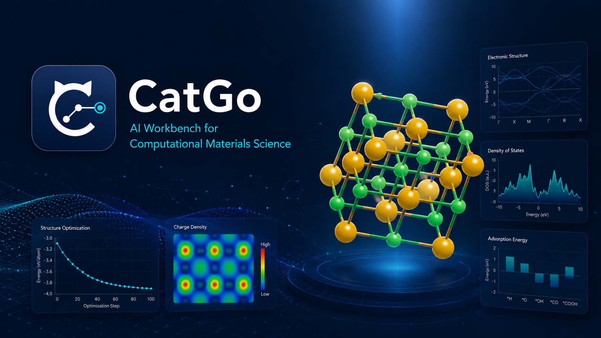
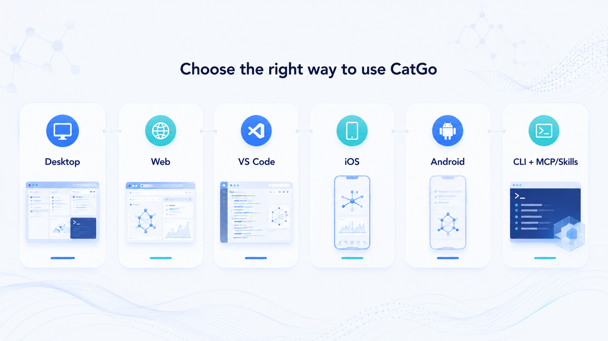
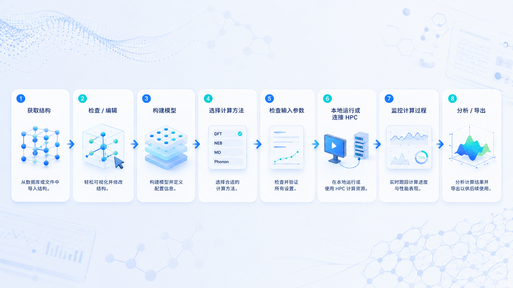
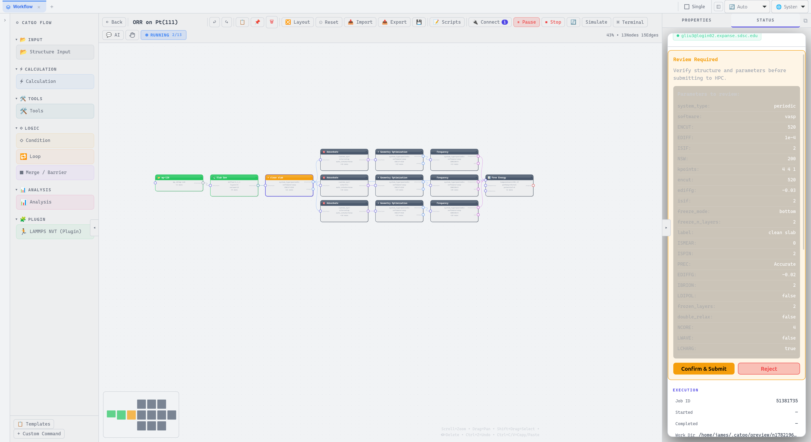
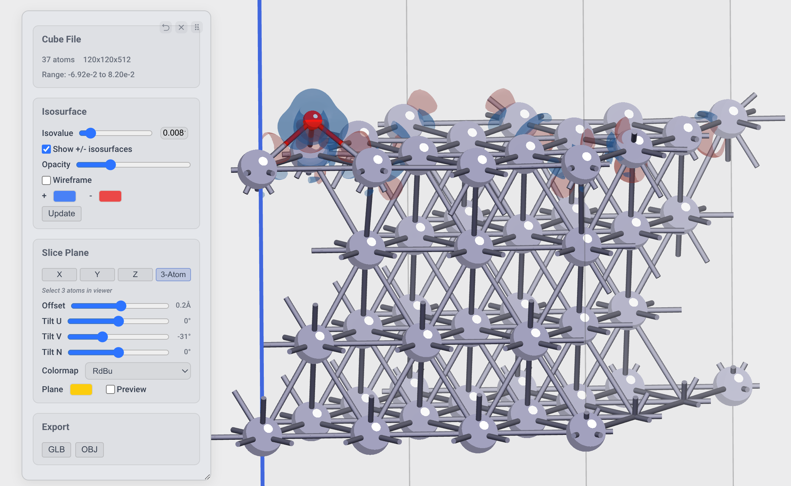
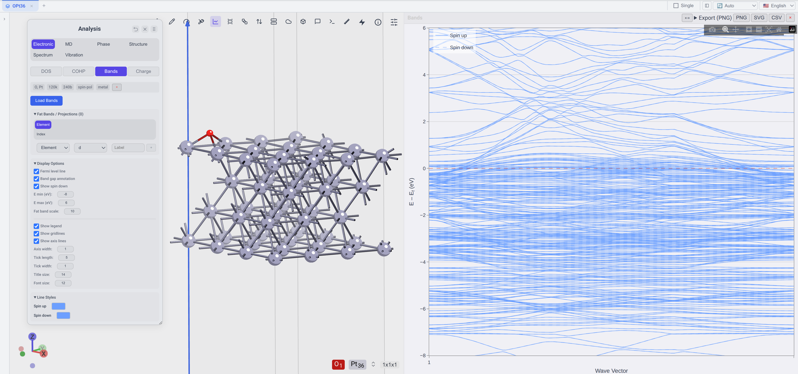
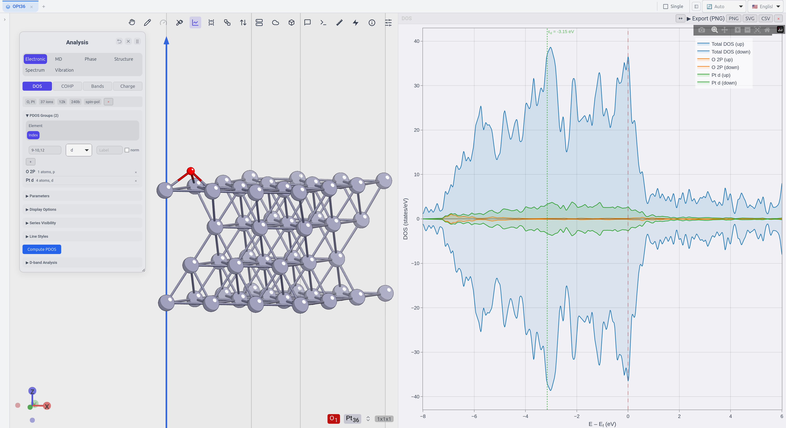

<p align="center">
  
</p>

# CatGo：AI 驱动的计算材料科学工作台

<p align="center">
  <a href="readme_new.md">English</a>
  ·
  <a href="https://app.catgo-ucsd.org">在线体验</a>
  ·
  <a href="https://github.com/Hello-QM/catgo-LRG/releases">下载桌面版</a>
  ·
  <a href="https://docs.catgo-ucsd.org">教程与文档</a>
</p>

<p align="center">

[](https://github.com/Hello-QM/catgo-LRG/actions/workflows/test.yml)
[](license)

</p>

CatGo 将计算材料研究中的常用工具整合进同一个工作空间：交互式三维结构编辑器、用于自然语言操作的 **CatBot**、可视化 DAG 工作流引擎、远程集群连接与作业监控，以及结构、轨迹、电子性质和催化结果分析。

它面向那些经常在结构搭建软件、终端、SSH/SFTP 客户端、调度器命令、计算日志和绘图脚本之间切换的研究者。CatGo 不替代科学判断，也不提供商业计算软件许可证或计算资源；它帮助你在已有环境中准备、检查、运行和管理计算任务。

> CatGo 借鉴了 **[MatterViz](https://github.com/janosh/matterviz)**（作者 [Janosh Riebesell](https://github.com/janosh)）：3D 结构查看器、元素周期表以及大量核心 UI 组件都源自 MatterViz，CatGo 在此基础上做了大量修改。在此之上 CatGo 新增了催化计算管线、工作流引擎、超算集成、CatBot 与插件系统。在此向 MatterViz 致以最深的谢意。

## CatGo 把哪些工作放到了一起

| 研究任务             | 可以完成的工作                                                               |
| ---------------- | --------------------------------------------------------------------- |
| **查看和编辑结构**      | 打开晶体、分子、表面、体数据和轨迹；旋转、选择、测量、添加、移动、替换或删除原子；编辑晶胞和化学键；撤销与重做修改             |
| **搭建计算模型**       | 创建超胞和 Miller 指数 slab，添加真空层与固定层，放置吸附物，并准备缺陷、掺杂、异质结、纳米管、MOF、钝化表面和溶剂化模型  |
| **准备计算**         | 生成并检查输入文件，使用 Quick Build 配方，或在可视化工作流中连接几何优化、单点、频率、DOS、NEB、MD 和分析步骤    |
| **使用 CatBot**    | 用自然语言获取结构、搭建模型、编辑工作流、检查文件或执行分析；工具调用过程保持可见，便于审核                        |
| **连接自己的 HPC 环境** | 通过 SSH 连接，浏览和编辑远程文件，打开远程结构，提交调度器作业，跟踪日志与收敛，并取回结果                      |
| **分析和展示结果**      | 检查优化/MD/NEB/IRC 轨迹、DOS/PDOS、能带、COHP/ICOHP、电荷密度等值面、XRD/RDF、相图、自由能图和火山图 |

---

## 1 分钟看懂 CatGo：从打开结构到生成 ORCA 输入

这段演示展示了 CatGo 最基础的使用流程，不需要预先配置 HPC 或创建复杂工作流：

1. **打开结构**：搜索 Cu 结构并确认导入。
2. **三维查看**：直接在查看器中旋转和缩放结构。
3. **进入导入/导出面板**：切换到 **ORCA** 导出选项。
4. **设置计算**：选择任务类型和电子结构计算参数。
5. **生成并复制**：生成 ORCA 输入文件，复制可继续修改的计算脚本。

<p align="center">
  
</p>

其他计算软件的导出也遵循同一套逻辑：载入或搭建结构，检查模型，选择目标软件，核对生成的输入，然后复制或下载。

这段录屏用于展示交互方式，并不代表一套推荐的生产计算设置。真正运行 ORCA 前，请根据体系核对分子模型、总电荷、自旋多重度、计算方法、基组、色散修正和资源参数。

### 可以直接这样问 CatBot

```text
从 Materials Project 获取 Cu，切一个 (111) 四层 slab，
加 15 Å 真空层，并在 hollow 位放一个 O。
```

```text
为当前结构创建 VASP 弛豫 → 静态计算 → DOS 分析工作流。
先让我检查输入，不要直接提交。
```

```text
读取这个 OUTCAR，告诉我是否按最大力收敛，并打开最终结构。
```

下面的实机演示展示了 CatBot 的 Agent 工作方式：它理解 slab 与吸附物搭建需求，连续调用所需的 CatGo 工具，并把生成的结构更新到查看器中。为控制 GIF 时长，录屏经过压缩剪辑；实际运行时还会显示更多中间工具调用和状态更新。

<p align="center">
  
</p>

---

## 先选一个适合你的入口

CatGo 有三个适合日常使用的成熟入口：桌面版、Web 版和 VS Code 扩展；此外，iOS 版已经在 iPhone/iPad 真机上验证，目前以测试版或自行构建的方式使用。Android 与 CLI/MCP 也已有实现，更适合实验性或高级使用场景。

| 入口                   | 最适合谁                                | 是否需要安装   | 主要能力                                            |
| -------------------- | ----------------------------------- | -------- | ----------------------------------------------- |
| **桌面版（推荐）**          | 想完成完整科研流程的用户                        | 是        | 完整工作台：多面板、CatBot、工作流、终端、HPC、分析                  |
| **Web 版**            | 想立即查看/编辑结构或先体验的用户                   | 否        | 在托管的静态应用中查看、编辑、构建和导出                            |
| **VS Code 扩展**       | 已在 VS Code/Cursor 和远程服务器上工作的用户      | 是        | 在编辑器内查看、编辑、播放和导出结构/轨迹                           |
| **iOS 版**            | 想在 iPhone/iPad 上测试集群连接、结构查看和任务处理的用户 | 测试版或自行构建 | 移动工作区、SSH/SFTP、终端、结构与轨迹查看、CatBot、语音输入           |
| **Android**          | 希望在 Android 上测试移动工作流的用户             | 实验性构建    | 移动工作区、SSH/SFTP、终端、结构查看、移动 AI                    |
| **CLI + MCP/Skills** | 自动化、脚本和外部 AI agent 用户               | 是        | 用 `catgo` 命令或 Claude Code/Codex/Gemini 驱动 CatGo |

<p align="center">
  
</p>

---

## 各平台怎么用

### A. 桌面版：完整工作台

1. 从 [GitHub Releases](https://github.com/Hello-QM/catgo-LRG/releases) 下载 Windows、macOS 或 Linux 安装包。
2. 打开 CatGo，拖入结构/输出文件，或从数据库获取结构。
3. 使用结构工具栏、Quick Build 或 CatBot 准备模型与流程。
4. 需要远程计算时，在 HPC 面板连接课题组集群。
5. 在提交前检查输入文件和作业参数，确认后再运行。
6. 在工作流和项目面板中监控状态、打开结果并继续分析。

### B. Web 版：打开即用

**入口：** <https://app.catgo-ucsd.org>

1. 打开网页，把结构文件拖进查看器。
2. 旋转、选择、编辑、构建并导出结构；无需安装 CatGo。

公共网站以纯静态模式构建，因此不提供后端工作流、终端和 HPC 功能。开发者可以按照 [`deploy/web/README.md`](deploy/web/README.md) 自行构建可连接后端的静态前端，并连接用户自己运行的 CatGo 后端。该后端没有内置认证层，必须限制在本机回环地址或受控私有网络中，绝不能直接暴露到公网。

### C. VS Code 扩展：在代码与数据旁边查看

1. 在 VS Code 扩展市场搜索 **CatGo** 并安装。
2. 右键结构或轨迹文件，选择 **Open with CatGo / Render**。
3. 也可按 <kbd>Ctrl</kbd>/<kbd>Cmd</kbd> + <kbd>Shift</kbd> + <kbd>V</kbd>。
4. 使用 VS Code Remote SSH 时，可直接查看远程服务器上的结构和轨迹。

扩展包含完整的单窗口查看器与编辑工具，但不包含桌面版的多面板工作区、独立工作流编辑器和完整 HPC 作业管理器。

### D. iOS 版：把集群和结构装进口袋

**适合：** 离开工作站后查看作业、浏览远程文件、打开结构/轨迹，或直接通过手机终端处理集群任务。

1. 在 iPhone 或 iPad 上打开 CatGo iOS。
2. 添加课题组集群的 SSH 信息，可使用密码、私钥和交互式认证。
3. 通过移动终端或 SFTP 文件浏览器进入计算目录。
4. 点击结构、轨迹或输出文件，在移动查看器中直接打开。
5. 查看和管理 SLURM 作业，也可以使用 CatBot 与语音输入完成轻量操作。

iOS 使用专门设计的移动界面，而不是简单缩小桌面窗口。SSH/SFTP 由设备上的原生 Rust 通道处理，不依赖桌面端 Python sidecar。复杂的工作流编辑和完整后处理仍建议在桌面端完成。

当前 iOS 构建已经通过真机运行验证。可通过 **TestFlight 公测**加入：[testflight.apple.com/join/FdHup5Hz](https://testflight.apple.com/join/FdHup5Hz)。其他安装渠道与公开发布状态以项目最新发布说明为准；开发者也可以按照 [iOS 构建指南](deploy/ios/README.md) 使用 Xcode 构建和签名。

### E. Android：实验性移动端

Android 版与 iOS 版共享移动工作区、原生 SSH/SFTP、终端、结构查看和移动 AI。目前 Android 更适合开发测试与特定移动场景。

- Android：[`deploy/android/README.md`](deploy/android/README.md)
- Android Termux：[`deploy/termux/README.md`](deploy/termux/README.md)

### F. CLI、MCP 与 Skills：给自动化和外部 Agent

CLI、HTTP/stdio MCP 工具和科研 skills 不是独立图形平台，而是驱动 CatGo 后端、工作流和文件能力的接口。

```bash
catgo setup
catgo serve
catgo status
catgo --help
```

`catgo setup` 目前会为 Claude Code 注册 CatGo MCP 服务和 campaign skills。Codex、Gemini 等 agent 在手动完成 MCP 与 skills 配置后，也可以使用相同能力。

这些 agent 可以执行结构处理、创建文件优先的 campaign、生成输入、提交任务和分析结果。桌面版 CatBot 既可连接受支持的 SDK agent，也可使用兼容 API 或本地模型服务；移动端使用兼容 API 的模型服务，不加载桌面 SDK sidecar。

---

## 通用科研流程

```text
获取结构 → 查看/编辑 → 构建体系 → 选择计算方法
→ 检查输入 → 本地运行或连接 HPC → 监控 → 分析/导出
```

- **先检查，再提交**：新结构、输入文件、赝势/基组路径和作业脚本默认应由人确认。
- **本地与 HPC 不同**：结构操作和许多分析可在本地或浏览器完成。实际执行位置取决于工作流节点和用户配置；VASP、CP2K 等需要用户或所在机构提供相应的软件安装与计算环境。
- **CatBot 不是黑箱替代品**：它可以调用工具和创建流程，但计算设置与科学判断仍应由研究者审核。
- **集群配置不能靠猜**：第一次提交前，必须确认集群身份、调度器、程序或 module 命令、Python 环境，以及 POTCAR/赝势路径。

<p align="center">
  
</p>

桌面版和文件优先的 campaign 工具可以覆盖这条完整路径；Web、VS Code 和移动端则聚焦于适合各自平台的环节，例如查看、编辑、文件访问、作业监控或轻量 Agent 操作。

---

## 典型研究场景

### 结构搭建

通过 Materials Project 或其他数据库提供的 API 获取结构；切 slab、加真空层、扩超胞；放置吸附物，生成缺陷、掺杂、异质结和 MOF。

<p align="center">
  
</p>

### 计算工作流

用 Quick Build 或可视化 DAG 串联优化、单点、频率、DOS、NEB、MD；先用快速势预筛选，再进入 DFT。

<p align="center">
  
</p>

### 催化与自由能

搭建并比较 OER、HER、ORR、CO₂RR 和 NRR 反应路径，整理吸附能、零点能与热修正、Gibbs 自由能、过电位、自由能图和基于描述符的火山图。自由能研究需要热化学数据：对相关物种应进行合适的几何优化和频率/热力学计算，不能直接把原始电子能当作 Gibbs 自由能。

### 轨迹、电子结构与发表级输出

回放几何优化、MD、NEB 和 IRC 轨迹；分析 DOS/PDOS、能带、COHP/ICOHP、d 带中心、XRD、RDF 和电荷密度体数据；导出图片、视频、CSV 表格、结构文件和三维模型。外部 Bader 计算得到的电荷可以作为原子位点属性显示，但 CatGo 本身不执行 Bader 分区积分。

<p align="center">
  
</p>

<p align="center">
  
</p>
<p align="center">
  
</p>

---

## 支持的软件与文件

“支持”可能代表不同层级。下表中的**读取**是指 CatGo 能把文件导入查看器或内部数据模型；**写出**是指能够导出结构或输入文件。二者都不表示 CatGo 已捆绑相应模拟程序或提供其许可证。

| 软件                           | 读取                                                                                   | 写出                                            |
| ---------------------------- | ------------------------------------------------------------------------------------ | --------------------------------------------- |
| **VASP**                     | POSCAR、CONTCAR、`.vasp`、vasprun.xml、OUTCAR、XDATCAR、CHGCAR/AECCAR/LOCPOT/ELFCAR/PARCHG | POSCAR、INCAR、KPOINTS                          |
| **Quantum ESPRESSO**         | pw.x 输入（`.in`；scf/relax/…）                                                           | pw.x 输入                                       |
| **CP2K**                     | `.inp`、`.restart`                                                                    | 包含晶胞、坐标与 k 点的 CP2K 输入                         |
| **ABACUS**                   | STRU                                                                                 | INPUT、STRU、KPT                                |
| **ORCA**                     | `.inp`、`.out`，支持笛卡尔坐标、内坐标和 `%coords`                                                 | ORCA 输入                                       |
| **Gaussian**                 | `.gjf`、`.com`、Z-matrix、`.log`、`.out`、cube                                            | `.gjf`                                        |
| **CASTEP / SIESTA / OpenMX** | `.cell` / `.fdf` / `.dat`                                                            | 仅导入                                           |
| **LAMMPS**                   | `.data`、`.lmp`、dump、`.lammpstrj`                                                     | data 文件和运行脚本                                  |
| **GROMACS / AMBER / SPARK**  | —                                                                                    | GROMACS 输入文件集 / AMBER mdin / SPARK kMC-MKM 输入 |
| **ASE / phonopy / phono3py** | ASE `.traj`、extXYZ / phonopy 系列 YAML                                                 | extXYZ / 仅导入                                  |

| 数据类型        | 读取                                                                            | 写出                           |
| ----------- | ----------------------------------------------------------------------------- | ---------------------------- |
| **晶体学**     | CIF、mCIF、pymatgen JSON、OPTIMADE JSON                                          | CIF、pymatgen JSON            |
| **分子**      | XYZ、extXYZ、mol2、PDB、PubChem JSON                                              | XYZ、extXYZ、mol2、PDB          |
| **轨迹 / MD** | XDATCAR、OUTCAR、多帧 extXYZ、ASE `.traj`、LAMMPS dump、HDF5、vasprun.xml、JSON frames | 多帧 extXYZ、WebM/MP4 视频、PNG 序列 |
| **体数据**     | Gaussian cube 与 VASP CHGCAR 系列                                                | —                            |
| **图片与三维模型** | —                                                                             | PNG、JPG、TIFF、SVG、PDF、GLB、OBJ |
| **文档预览**    | PDF、DOCX、XLSX/XLS/ODS、CSV/TSV、Markdown/RST、图片                                 | —                            |

### 计算与工作流支持

- **可用于生产的本地路径**：结构搭建与分析节点、ORCA 计算、本地 LAMMPS 模式和本地 MLP 模式。
- **可用但仍在过渡中的 HPC 路径**：VASP、CP2K、xTB、LAMMPS 和 MLP 工作流通过 Python HPC 适配层执行。这些路径需要 SSH 与已配置的调度器，其重试和断点恢复能力目前比本地 DAG 引擎更简单。
- **可以导出输入，但没有可执行工作流引擎**：Quantum ESPRESSO、ABACUS、Gaussian、GROMACS、AMBER、SPARK 及上表中的其他导出器。Gaussian 和 GROMACS 工作流节点尚不能执行，Quantum ESPRESSO 的工作流引擎定义也尚未实现。
- **Skill 辅助指导**：GPAW、ABINIT、SIESTA、DFTB+、Gaussian 及其他任务型 skills 可以提供 agent 可读取的流程指南或输入草稿。Skill 代表指导能力，不代表 CatGo 已能端到端执行对应软件。
- **快速预筛选**：安装相应可选软件包或可执行程序后，可使用 MACE、CHGNet、M3GNet、EMT 和 xTB/GFN-xTB。
- **后处理**：DOS/PDOS、能带、COHP/ICOHP、d 带中心、布里渊区工具、XRD、RDF 与 MD 统计、电荷密度可视化、热化学、自由能图、火山图和相图。

具体能力取决于 CatGo 版本、已安装的可选依赖，以及工作站或集群上可用的程序。CatGo 不分发商业模拟软件、专有势函数、赝势文件或集群计算额度。

---

## 安装与开始

- **最快体验**：打开 [Web 版](https://app.catgo-ucsd.org)，直接查看、编辑、搭建和导出结构。
- **完整功能**：从下表下载预编译安装包。发布安装包已经捆绑后端和 Agent bridge，普通用户无需另装 Python 或 Node.js。
- **编辑器内使用**：在 VS Code 扩展市场搜索 **CatGo**。

### 下载

下表所有链接都指向**最新发布版**，随版本更新自动保持最新 —— 当前版本：[](https://github.com/Hello-QM/catgo-LRG/releases/latest)。在发布页选择对应平台的文件（见 **文件** 列）。历史版本与校验和见 [全部 Releases](https://github.com/Hello-QM/catgo-LRG/releases)。

| 系统 | 获取最新版 | 发布页上的文件 |
| --- | --- | --- |
| **Windows** | [⬇ 下载](https://github.com/Hello-QM/catgo-LRG/releases/latest) | `CatGo_<ver>_x64-setup.exe` 或 `CatGo_<ver>_x64_en-US.msi` |
| **macOS**（Apple Silicon） | [⬇ 下载](https://github.com/Hello-QM/catgo-LRG/releases/latest) | `CatGo_<ver>_aarch64.dmg` |
| **Linux** | [⬇ 下载](https://github.com/Hello-QM/catgo-LRG/releases/latest) | `CatGo_<ver>_amd64.deb` 或 `CatGo-<ver>-1.x86_64.rpm` |
| **Android** | [⬇ 下载](https://github.com/Hello-QM/catgo-LRG/releases/latest) | `CatGo-v<ver>-android-universal.apk` |
| **iOS** | [TestFlight 公测](https://testflight.apple.com/join/FdHup5Hz) | 或发布页的 `CatGo-v<ver>-ios-arm64.ipa` |
| **VS Code** | 在扩展市场搜索 **CatGo** | 或发布页的 `catgo-<ver>.vsix` |
| **Web**（免安装） | [app.catgo-ucsd.org](https://app.catgo-ucsd.org) | — |

### 推荐：用 AI 编码 Agent 从源码构建

想要最新版和完全可控，可以让 CLI 编码 Agent 帮你安装并部署 CatGo —— 它会处理依赖、Rust/WASM 构建并启动整个栈：

1. 安装一个 CLI 编码 Agent：[Codex CLI](https://github.com/openai/codex) 或 [Claude Code](https://www.anthropic.com/claude-code)。
2. 在一个空目录里打开它，运行 **`/goal`** 命令并粘贴下面的 prompt。

<details>
<summary><b>/goal prompt —— 复制粘贴</b></summary>

```text
Install and deploy CatGo from source on this machine, end to end, and leave it running.

1. Prerequisites: detect the OS, then install whatever is missing — git, Node.js 20+, pnpm,
   Python 3.11 (prefer a fresh conda or uv environment), the stable Rust toolchain, and
   wasm-pack. Use the system package manager / conda / rustup as appropriate; do not assume
   anything is preinstalled.
2. Source: clone https://github.com/Hello-QM/catgo-LRG.git and cd into it.
3. Python backend: create and activate a Python 3.11 environment named `catgo`, then
   `pip install -r server/requirements.txt`.
4. Frontend + native: run `pnpm install`, then `pnpm build:wasm` to build the Rust/WASM
   modules (ferrox, chgdiff, catrender).
5. Run: `pnpm desktop:serve` to start the frontend, Python backend, and agent bridge together.
   If it launches the wrong Python, re-activate the `catgo` env or set PYTHON to its absolute path.
6. Verify: confirm the backend /health endpoint responds and the frontend loads in a browser,
   then print the local URL.

Rules: explain each step before running it; stop and ask me before any credential prompt or
destructive action; never overwrite an existing `catgo` environment without confirming. Fix
errors as they come up (missing build deps, wrong interpreter, WASM build failures) until the
app is actually serving.
```

</details>

### 从源码运行（开发者）

请先安装 Node.js 20 或更高版本、pnpm、Python 3.11 和稳定版 Rust 工具链；构建 WASM 还需要 `wasm-pack`。然后按以下顺序运行：

```bash
git clone https://github.com/Hello-QM/catgo-LRG.git
cd catgo-LRG

conda create -n catgo python=3.11
conda activate catgo
pip install -r server/requirements.txt

pnpm install
pnpm build:wasm
pnpm desktop:serve
```

对于全新的源码检出，这三个 pnpm 命令都需要执行：安装工作区依赖、构建 Rust/WASM 模块，以及同时启动前端、Python 后端和 Agent bridge。如果 `desktop:serve` 使用了错误的 Python 解释器，请重新激活 `catgo` 环境，或把 `PYTHON` 设置为该环境中 Python 可执行文件的绝对路径。

完整构建说明见 [安装文档](https://docs.catgo-ucsd.org/guide/installation)。

---

## 文档、社区与贡献

| 需要            | 入口                                                                              |
| ------------- | ------------------------------------------------------------------------------- |
| 第一次导入、编辑、导出结构 | [Getting Started](https://docs.catgo-ucsd.org/tutorials/basics/getting-started) |
| slab、优化、轨迹等教程 | [Tutorials](https://docs.catgo-ucsd.org/tutorials/)                             |
| CatBot        | [CatBot Guide](https://docs.catgo-ucsd.org/guide/catbot)                        |
| 后端、HPC、MCP    | [Server & MCP Docs](https://docs.catgo-ucsd.org/modules/server/)                |
| 报告问题          | [GitHub Issues](https://github.com/Hello-QM/catgo-LRG/issues)                   |
| 讨论与提问         | [CatGo Forum](https://groups.google.com/g/catgo_official)                       |

欢迎提交真实科研痛点、示例结构、工作流、截图、解析器、计算引擎、skills 和集群测试。请阅读 [`contributing.zh.md`](contributing.zh.md)。

---

## 致谢、引用与许可证

CatGo 的结构查看器、元素周期表和部分核心 UI 源自并受到 [MatterViz](https://github.com/janosh/matterviz)（作者 [Janosh Riebesell](https://github.com/janosh)）的启发 —— 包括 3D 结构查看器、元素周期表组件、元素数据、配色方案以及大量 UI 模式。CatGo 在此基础上做了大量修改，但根基仍来自 MatterViz，在此向原作者致以最深的谢意。在此之上 CatGo 扩展了计算工作流、HPC、CatBot、催化分析与跨平台应用。

**CatRender** 是 CatGo 的 Rust/WASM 分子 SVG 渲染器。它以忠实复现为目标移植自 [aligfellow/xyzrender](https://github.com/aligfellow/xyzrender)；后者的技术脉络还包括 [xyz2svg](https://github.com/briling/xyz2svg)。CatRender 在此基础上增加了 CatGo 的交互控制和导出集成。

如果 CatGo 对论文工作有贡献，请引用 ChemRxiv 预印本：

```bibtex
@misc{liu2026catgo,
  author    = {Liu, Guangsheng and Ma, Xiao and Zhang, Leshen and Pascasio, Jenedith and Yang, Jonathan and Chen, Yuxiang and Li, Wan-Lu},
  title     = {CatGo: Bridging CLI Coding Agents with Interactive Structure and Workflow Management for Computational Chemistry},
  year      = {2026},
  doi       = {10.26434/chemrxiv.15002984/v1},
  url       = {https://doi.org/10.26434/chemrxiv.15002984/v1},
  publisher = {ChemRxiv},
  note      = {Preprint},
}
```

软件版本的引用信息见 [`citation.cff`](citation.cff) 和 Zenodo 存档 [10.5281/zenodo.19709425](https://doi.org/10.5281/zenodo.19709425)。项目采用 [GNU AGPL-3.0-or-later](license)。

---

## 社区

扫码加入 CatGo QQ 群：


---
